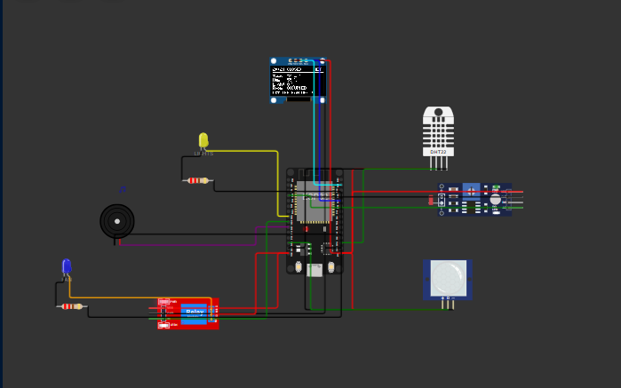
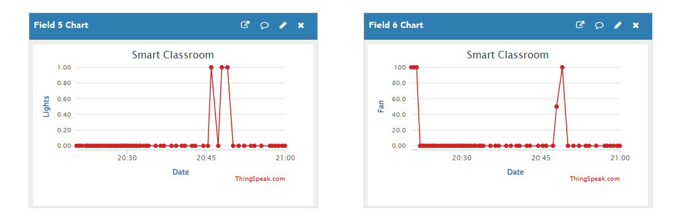

# Smart Classroom Automation


An ESP32 that runs a classroom on its own. It reads temperature, humidity, ambient light and occupancy, then decides what the lights and the fan should be doing, shows its reasoning on an OLED, and reports everything to a cloud dashboard. Runs entirely in simulation, so there is no hardware to buy.

The part worth reading is not the sensors, it is what happens when two rules disagree. A dark room says turn the lights on. The clock says it is 21:00 and nobody should be here. A teacher's phone says run the fan anyway. Three sources of authority, and something has to arbitrate.

```
sensors and thresholds     lights when dark, fan speed from temperature
        v
timetable                  outside teaching hours, comfort loads stay off
        v
remote override            a cloud command beats both, then expires
```

Each layer overrules the one above it. The over temperature alarm sits outside that stack entirely and answers to temperature alone, because an overheating empty room at midnight still needs to raise a flag.

**The live channel is public: <https://thingspeak.mathworks.com/channels/3451260>.** Every chart there was written by the simulated ESP32 over the Wokwi network gateway, not by a script posting numbers.



## What it does

- **Turns the lights on when they are needed,** meaning the room is dark *and* somebody is in it. Neither condition alone is enough. An 8 point hysteresis band on the light reading stops the LED chattering when the level sits near the threshold.
- **Drives the fan proportionally**, not on and off. Speed ramps from 0 to 100 % between 28 C and 34 C as an LEDC PWM duty cycle, with a floor of 30 % because a real motor will not start from rest on a low duty. The PWM runs *through the relay contacts*, so the relay stays a genuine isolation stage and the speed signal only reaches the load once it closes.
- **Knows what time it is.** Wall clock comes from NTP over the simulated network. Outside teaching hours the lights and fan are held off no matter what the sensors report. The schedule fails open if NTP never answers, because an unsynced clock should not leave a room dark.
- **Takes orders from the cloud.** A ThingSpeak TalkBack queue is polled every 20 seconds. `FAN_ON` from a browser overrules both the sensors and the timetable within 20 seconds, and reverts to automatic after five minutes so a forgotten command cannot run the fan all night.
- **Raises an alarm regardless.** Above 35 C the buzzer sounds whether the room is occupied, empty, in session or closed.
- **Publishes eight fields every 15 seconds** to ThingSpeak, including the fan duty cycle and a code saying which layer is currently in control, so the dashboard alone tells you whether the fan is running because of temperature or because somebody pressed a button.
- **Explains itself locally** on a 128x64 OLED: clock, session state, all three readings, occupancy, and the actuator states with an asterisk marking anything under manual control.

## How the fan is driven

Most classroom projects treat a fan as a switch. Temperature crosses a line, relay closes, full speed. That is a bang bang controller, and it has the failure everybody knows: it overshoots, then undershoots, and cycles the load.

Here the relay and the speed control are separated, because they answer different questions.

```
GPIO 32 (LEDC PWM) ──> relay COM ──> NO ──> fan
GPIO 26 ────────────> relay IN  (isolation, energised whenever speed > 0)
```

`demandedSpeed()` interpolates the duty cycle linearly between `FAN_ON_C` and `FAN_FULL_C`, so 31 C asks for roughly half power rather than all of it. The relay is not part of that decision. It closes when any speed at all is demanded and opens when none is, which is what an isolation stage is for on real mains hardware: the contactor carries the load, the controller decides how hard to drive it.

Starting the fan and stopping it are also asymmetric on purpose. It starts above 28 C and does not stop until 26.5 C, a 1.5 degree hysteresis band, so a room hovering at the setpoint does not switch the relay every two seconds.

You can see the difference in the cloud data. A bang bang fan draws a square wave on field 6. This one draws a staircase.



## Hardware

All simulated in Wokwi, no physical parts required.

| Component | Role | ESP32 pin |
|---|---|---|
| DHT22 | temperature and humidity | GPIO 15 |
| Photoresistor module | ambient light | GPIO 34 (ADC1_CH6) |
| PIR HC-SR501 | occupancy | GPIO 13 |
| SSD1306 OLED 128x64 | status display | GPIO 21 SDA, GPIO 22 SCL |
| Relay module | fan isolation stage | GPIO 26 |
| LEDC PWM | fan speed, through the relay contacts | GPIO 32 |
| LED and 220R | classroom lights | GPIO 25 |
| Buzzer | over temperature alarm | GPIO 27 |

The photoresistor module's analog output *falls* as the room brightens, which is the opposite of what you would guess. `LDR_RAW_DARK` is therefore the larger constant, 4063 at 0 lux against 32 at maximum. Both numbers were measured off the simulated part rather than assumed, and the raw ADC count is printed on every telemetry line so the mapping can be recalibrated without guesswork.

## The cloud side

| Field | Value |
|---|---|
| 1 | temperature C |
| 2 | humidity % |
| 3 | ambient light % |
| 4 | occupied (0/1) |
| 5 | lights (0/1) |
| 6 | fan speed (0 to 100 %) |
| 7 | alarm (0/1) |
| 8 | override code |

Field 8 is two digits: tens for the fan, units for the lights, where 0 is automatic, 1 is forced on and 2 is forced off. So 10 means the fan is running because somebody told it to, and 0 means every actuator is following the sensors.

Commands accepted on the TalkBack queue:

| Command | Effect |
|---|---|
| `FAN_ON` | fan forced to full speed |
| `FAN_OFF` | fan forced off |
| `FAN_AUTO` | fan returns to temperature control |
| `LIGHTS_ON` | lights forced on |
| `LIGHTS_OFF` | lights forced off |
| `LIGHTS_AUTO` | lights return to sensor control |
| `ALL_AUTO` | clears both overrides |

Queuing a command is a POST. Pasting the URL into a browser address bar sends a GET, which lists the queue instead of adding to it, and answers `[]` on an empty queue.

## Project layout

```
Classroom automation/
├── sketch/
│   ├── sketch.ino        # firmware: sensing, the three control layers, telemetry
│   ├── config.h          # pin map, thresholds, timetable, PWM and ADC constants
│   └── secrets.h         # WiFi, ThingSpeak channel, TalkBack credentials
├── diagram.json          # Wokwi wiring, 11 parts
├── libraries.txt         # Wokwi library dependencies
├── wokwi.toml            # points the VS Code simulator at build/
└── docs/
    ├── SETUP.md          # running it, ThingSpeak channel, TalkBack, timetable
    ├── RUNBOOK.md        # full walkthrough with expected output at each step
    ├── DEMO.md           # the short demo checklist
    ├── SCREENSHOTS.md    # what to capture and how to reach each state
    └── screenshots/      # 15 captures, indexed with what each one proves
```

## Running it

Two routes. The website needs nothing installed; the VS Code extension builds locally and skips the cloud build queue.

### Wokwi in the browser

1. Open <https://wokwi.com/projects/new/esp32>.
2. Paste `sketch/sketch.ino` over the default sketch, and `diagram.json` over the default diagram.
3. Add `config.h` and `secrets.h` as new files with those exact names.
4. Add the five libraries from `libraries.txt` in the Library Manager tab.
5. Press play.

`Wokwi-GUEST` is the simulator's own access point and it reaches the real internet, so ThingSpeak receives real data from the simulation.

### Wokwi in VS Code

```bash
arduino-cli core install esp32:esp32
arduino-cli lib install "DHT sensor library" "Adafruit Unified Sensor" \
                        "Adafruit GFX Library" "Adafruit SSD1306" "ThingSpeak"
arduino-cli compile --fqbn esp32:esp32:esp32 --output-dir build sketch
```

Then run `Wokwi: Start Simulator` from the command palette. The firmware lives in `sketch/` because arduino-cli requires the sketch folder and the main `.ino` to share a name; Wokwi reads `diagram.json` and `wokwi.toml` from the repository root and does not care about the nesting.

Last verified build:

```
Sketch uses 993975 bytes (75%) of program storage space.
Global variables use 50420 bytes (15%) of dynamic memory.
```

Cloud credentials and the class timetable are covered in [docs/SETUP.md](docs/SETUP.md). For a guided run with the expected output at every step, follow [docs/RUNBOOK.md](docs/RUNBOOK.md).

## Tuning

Everything worth changing is a constant in `sketch/config.h`.

| Constant | Default | Meaning |
|---|---|---|
| `DARK_PCT` | 35 | light level below which the room counts as dark |
| `LIGHT_HYST_PCT` | 8 | how far past that it must climb before the lights release |
| `FAN_ON_C` | 28.0 | fan starts here |
| `FAN_FULL_C` | 34.0 | fan reaches 100 % here |
| `FAN_MIN_DUTY_PCT` | 30 | lowest duty a stationary motor will start on |
| `ALARM_C` | 35.0 | buzzer threshold |
| `VACANCY_MS` | 10000 | how long after the last motion the room stays occupied |
| `SCHOOL_START_MIN` / `SCHOOL_END_MIN` | 08:30 / 17:00 | teaching hours |
| `SCHOOL_DAY_MASK` | `0x3E` | one bit per weekday, bit 0 is Sunday |
| `OVERRIDE_TIMEOUT_MS` | 300000 | how long a remote override survives |

## Limitations

Found by running it, not imagined while designing it.

- **The fan is an LED.** Wokwi has no DC motor part, so speed shows as PWM brightness. The control logic is real, the load is a stand in.
- **Overrides live in RAM.** A reset clears them and everything returns to automatic. Defensible, arguably even correct for a safety related load, but it is not a decision the code makes deliberately.
- **Thresholds require a rebuild.** There is no runtime configuration, no serial command interface, no persistence in NVS. Retuning `FAN_ON_C` means recompiling and restarting.
- **A remote command takes up to 20 seconds** to arrive, because TalkBack is polled rather than pushed. Fine for a fan, wrong for anything that needs to respond immediately.
- **One room, one zone.** Occupancy is a single boolean from a single PIR, so the system knows somebody is present but not how many or where.
- **The ThingSpeak write key is in the repository.** Acceptable for a simulation whose channel holds nothing sensitive, not a pattern to copy onto hardware.
- **The DHT22 cannot be read faster than every two seconds,** which sets the control loop period and means the fan reacts to a temperature change a beat later than the display suggests.
- **The light reading carries a few counts of ADC noise,** which the hysteresis band absorbs. Without that band the LED would visibly flicker at the threshold.

## Things I would add next

- **Persist the thresholds in NVS** with a serial command interface, so tuning does not mean a rebuild.
- **Handle sensor failure explicitly.** A DHT22 that stops answering currently keeps the last good value forever with only a serial line to say so; it should degrade to a safe default and publish a health field.
- **Count people instead of detecting them,** with two IR gates giving entry and exit direction, so the fan can scale with the room rather than with a boolean.
- **Push instead of poll** using MQTT alongside ThingSpeak, cutting override latency from 20 seconds to sub second while keeping ThingSpeak for history.
- **Serve a local dashboard** from the ESP32 itself, so the room can be controlled without a round trip to the cloud.
